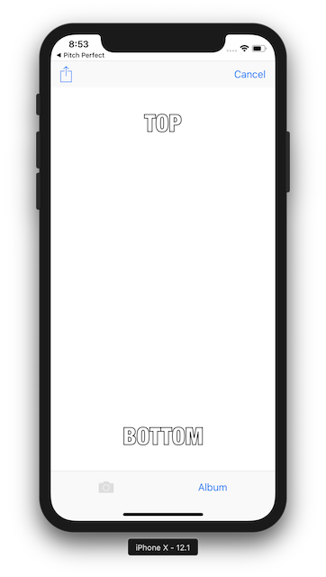
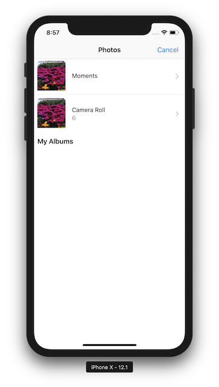
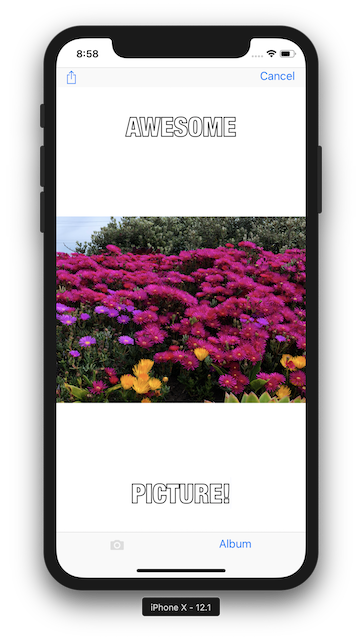
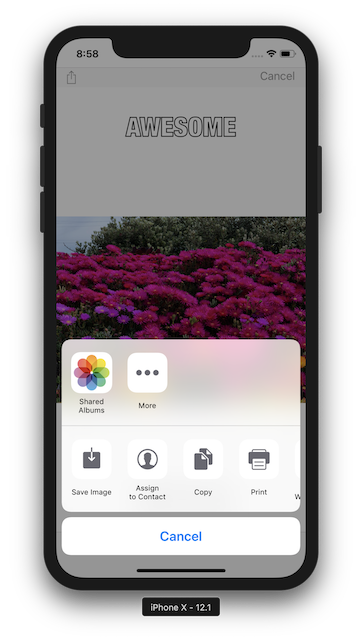
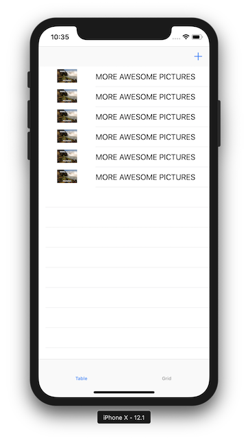
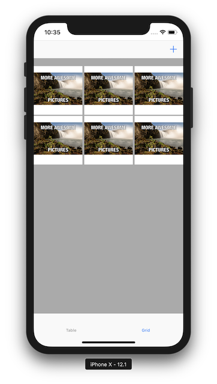

# Meme-Generator-V2.0
Version 1.0 of Meme Generator project for Udacity course

## Description
#### This app was created from scratch as an App Challenge from Udacity's iOS Nanodegree Course. 
Meme-Generator enables a user to take a picture, add text at the top and bottom to form a meme, and share that meme on Facebook and Twitter and also by SMS or email. In this project, sent memes will appear in a tab view with two tabs: a table view and a collection view.

### Objectives
- Set up a navigation structure that creates an intuitive flow through the app
- Build tables with datasources and delegates
- Create custom table view cells
- Implement user interfaces with tab views and collection views
## Screenshots
 
 
 

